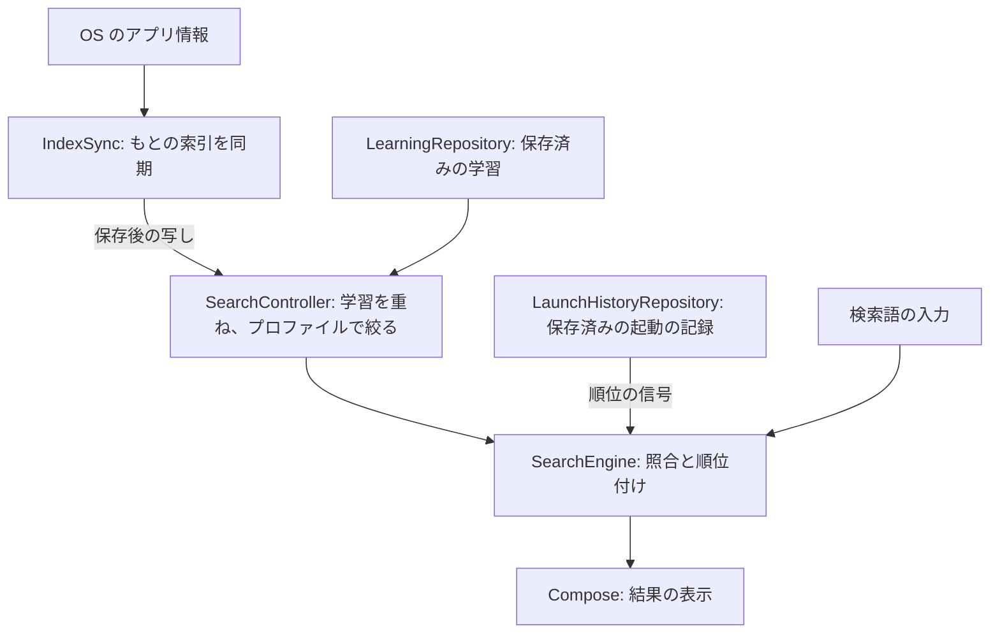
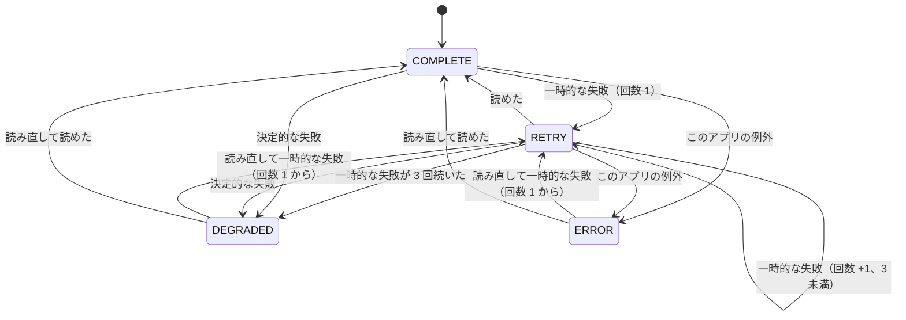

# 全体の構成

2026-11-14、R1〜R5・T7 の実装に合わせて更新（同期の失敗の扱いとデータの保存は 2026-11-15 に 0.2.0 の設計へ書き換え）。要件は [requirements.md](../requirements.md)、照合は [matching.md](matching.md)、学習は [learning.md](learning.md)、画面は [ui.md](ui.md)、テストは [testing.md](testing.md)。根拠にした API の挙動は [android-platform.md](../research/android-platform.md)。

## 範囲

v1（実機の試験（M6）に出す版）で扱うもの:

- 起動できるアプリ（ランチャーに並ぶ Activity。Activity は Android の画面 1 枚に当たる部品）の検索と起動。主プロファイルと仕事用プロファイルのアプリ
- 読み・表記ゆれ・英字のブランド名・ジャンル・学習による照合
- 呼び出し: ランチャーのアイコン、デジタルアシスタント、クイック設定タイル

扱わないもの: 連絡先・設定の項目・Web の検索、アプリのショートカットの起動（既定のホームアプリにしか許されない）、プライベートスペース（同）、ホーム画面の置き換え。ホーム画面のウィジェットは v1 の後に回す。

## 部品と流れ

索引は、アプリごとに名前・読み・ローマ字・ジャンルなどの検索キーを持つ。端末から作る索引と、利用者の学習・起動の記録は別に保存する。検索時にはその写しをメモリで組み合わせる。

```mermaid
flowchart TD
    os[OS のアプリ情報] --> sync[IndexSync: もとの索引を同期]
    sync -->|保存後の写し| derived[SearchController: 学習を重ね、プロファイルで絞る]
    learning[LearningRepository: 保存済みの学習] --> derived
    derived --> engine[SearchEngine: 照合と順位付け]
    history[LaunchHistoryRepository: 保存済みの起動の記録] -->|順位の信号| engine
    input[検索語の入力] --> engine
    engine --> screen[Compose: 結果の表示]
```

`SearchController` は ViewModel で、図の派生の索引と `SearchEngine` を持つ。入力と結果を `SessionTracker` に送り、アプリを選ぶと `LearningPolicy` で学習を判定する。保存の流れは[保存の順序と書き手](#保存の順序と書き手)、起動までの流れは[起動](#起動)に記す。

## 状態の持ち主

`PiuApplication` がプロセスに 1 つの `AppContainer` を持ち、保存と同期の部品を組み立てる。Activity は画面を描き、前面にある間だけ通知を受ける。

| 持ち主 | 持つ状態・役割 | 寿命・保存先 |
|---|---|---|
| `IndexSync` | もとの索引の写し、同期の状態、未処理のパッケージ通知と世代 | プロセス。索引と前回の同期の材料は Room に保存 |
| `LearningRepository` | 学習の写しと読み込み状態、未消費の救済の知らせ、取り消し材料、ファイル操作 | プロセス。学習だけ Room に保存し、知らせと取り消し材料はメモリだけ |
| `LaunchHistoryRepository` | 起動の記録の写しと読み込み状態 | プロセス。記録は Room に保存 |
| `ProfileReconciler` | 確認できたプロファイルの一覧と削除済みの番号 | プロセス。起動時にも保存先と OS を照合 |
| `IndexLifecycle` / `ProfileLifecycle` | Callback・放送の登録、検索画面の表示状態、同期・忘却・削除の照合のきっかけ | プロセス。`PiuApplication.onCreate` で監視を始める |
| `SearchController` | 検索語、タブ、全アプリ一覧の表示、セッション、派生の索引、起動中と知らせの保留の印 | ViewModel。回転で保つ。`SavedStateHandle` に保存するのは現在の検索語だけ |
| `LearnedListViewModel` | 学習の一覧で表示する操作結果 | ViewModel。未消費の最新の結果は `AppContainer.backupOutcome` にも残す |
| `SearchActivity` / `LearnedListActivity` | 画面への接続、表示用の写し、OS の画面を開く操作 | Activity。再作成時には ViewModel とプロセスの部品につなぎ直す |
| `AppContainer` の解析器・アイコン | Kuromoji の辞書、アイコンのキャッシュ | プロセス。`onTrimMemory` で手放し、次に必要になったら読み直す |

セッションの入力履歴は、アプリを選ぶ・構成の変更以外で画面を離れる・別の検索として呼び直すと捨てる。回転では捨てない。プロセスを作り直したときは現在の検索語だけを戻し、前の試行は復元しない。

救済の知らせは `pendingNotices` で写しを読み、表示が終わったものを `consumeNotice` で消費する。回転のたびに取り出して戻す操作はしない。ファイル操作も画面を閉じてから完了でき、結果は次の学習一覧で受け取れる。結果の箱は最新の 1 件を持ち、プロセスが終われば消える。

## 保存の順序と書き手

索引・学習・起動の記録の読み書きは、共通の `DatabaseWriter`（1 本のスレッドの Executor）に並べる。学習の変更は、次の全体を 1 つの仕事として実行する。

1. 保存済みの内容を読めているか確かめる
2. 今の写しから変更を計算する
3. データベースへ保存する
4. 成功したらメモリの写しを差し替え、変更を通知する
5. 救済の知らせと取り消し材料を更新し、呼び出し元へ `StorageResult.Success` を返す

失敗した操作は `StorageResult.Failure` を返し、写し・知らせ・取り消し材料を変えない。起動の記録と学習は別々の保存で、片方だけ成功することもある。プロファイルの削除は、両方と索引を 1 つのトランザクションで消す。

学習と起動の記録の読み込み状態は `LoadState` で区別する。

| 状態 | 意味 | 次の操作 |
|---|---|---|
| `NotLoaded` | 未読 | 読み込みから始める |
| `Loading` | 読み込み中 | 同じ書き手の列で完了を待つ |
| `Ready` | 読み込みまたは保存が成功した | この写しから変更を計算する |
| `Failed` | 読み込みに失敗した | 読み直し、再び失敗したら書き込まずに失敗を返す |

読み込み状態とは別に、最後に読めた写しを保つ。保存失敗では `Ready` と写しを保ち、同じ操作をやり直せる。プロファイル削除を反映するときも、未読・読み込み失敗の状態を `Ready` に変えない。空の写しで保存済みの記録を上書きしないため。

失敗の伝え方は操作によって異なる。

| 操作 | 表示 |
|---|---|
| 学習一覧の読み込み・削除・全消去・ファイル操作 | 一覧の Snackbar。ファイルを読めても、変更の保存が失敗したら成功とは知らせない |
| 検索画面での記録の読み込み・忘却・抑制・削除・取り消し | 失敗を Toast で知らせる |
| 索引の同期 | 最後の索引で検索を続ける。同期全体かプロファイルの失敗だけを検索画面に小さく出し、組の材料の欠けは設定の「索引の状態」に出す（[知らせ](#知らせ)） |
| 起動の前の記録の保存 | 失敗しても起動する。「覚えた」の Toast は出さず、失敗はログに残す |
| 設定での起動記録の全消去 | 成功・失敗を Toast で知らせる |

ログにはアプリの識別子・URI と、それらを含み得る例外のメッセージを出さず、操作と例外の型を残す。索引の材料の欠けは、識別子つきで端末の中の表（`material_issue`）にだけ置き、利用者が設定で見てコピーできる。

## 画面の状態と派生の索引（R5）

`SearchController` は `ViewModelProvider` から取得する。Activity の再作成でも同じ ViewModel を使い、索引・学習・起動の記録の通知は画面の Executor へ移して反映する。

派生の索引は、もとの `SearchIndex` と `LearnedMemory` の参照、仕事用の番号の集合、表示設定が変わったときだけ作る。`derivedIndexExecutor` で学習を重ね、プロファイルで絞る。プロファイルだけの変更なら学習を重ねた索引を再利用する。未開始の要求は最新の 1 件にまとめ、完成時に材料が古くなっていたら捨てる。生成待ちには最後に完成した索引を使う。

起動の記録だけが変わったときは、派生の索引を作り直さず、順位の信号と結果を更新する。派生の生成中に記録が変わった場合も、反映時点の最新の信号を使う。

漢字の検索語の読みは別の `queryExecutor` で付ける。未開始の要求を最新の 1 件にまとめ、解析直前と反映前に世代を確かめる。画面を離れると未開始の要求を無効にする。実行中の Kuromoji の解析は止められないため、古い結果を捨てる。画面終了後に派生の索引が完成しても、入力の記録や読みを再開しない。

照合・結果の整形・空検索の候補・全アプリの名前順の作成は画面側に残る。派生の生成を裏へ移したことだけで、入力時間の上限を保証するものではない。500 入口・2 プロファイルでの計測は [testing.md](testing.md#画面の状態と派生の索引r5) に記す。

## モジュール

Gradle（Android の標準のビルドツール）のモジュール（ビルドとテストの単位。依存の向きを明示できる）に分ける。種類の「JVM」は、Android に依存せず PC の Java の実行環境（JVM）でそのまま動き、テストできるもの。

| モジュール | 種類 | 中身 | 依存 |
|---|---|---|---|
| `core:text` | JVM | 正規化、かな・ローマ字の変換、英字の頭字語の読み | なし |
| `core:reading` | JVM | `ReadingAnalyzer`（読みを付ける部品の interface）と Kuromoji による実装 | `core:text`、Kuromoji |
| `core:search` | JVM | 索引のモデル、検索キーの生成、照合と順位付け、ジャンルの語彙、学習の規則 | `core:text`、`core:reading` |
| `data` | Android ライブラリ | AppSource・GenreResolver・Room のデータベース・IndexSync | `core:*` |
| `app` | Android アプリ | 画面（Jetpack Compose。画面を Kotlin の関数で組み立てる Android 標準の UI のライブラリ）、呼び出しの入口（Activity・TileService）、設定の保存、部品の組み立て | `data`、`core:*` |
| `release-test` | Android のテスト（`com.android.test`。配布物に入らない） | R8 を通した版（app の `benchmarkRelease`）を、アプリの外から UiAutomator と shell で試す計器テスト | `app`（試す相手） |
| `benchmark` | Android のテスト（`com.android.test`。配布物に入らない） | 起動の速さの計測（Macrobenchmark）と Baseline Profile の生成 | `app`（試す相手） |
| `test-apps:*` | Android アプリ（テスト専用） | 日本語の名前や `geo:` を持つ小さなアプリ。エミュレータに入れて索引とジャンルを確かめる | なし |
| `tools:dict` | JVM（配布物に入らない） | ブランド表などの辞書の検査と変換 | `core:text` |

分ける理由:

- 照合と学習を Android から切り離し、エミュレータなしで速くテストする
- モジュールの境界で依存を検査する。`core:*` から Android の API は呼べない

部品は `AppContainer` で組み立てる。依存の注入のライブラリは使わない。

解析器の差し替えの境界（#45）は、**今の結合を許す**。`core:search` は `ReadingAnalyzer` を使うが、依存先の `core:reading` には interface と Kuromoji の実装が同居する。さらに `AppContainer` は具体型を作り、`IndexSync` も Kuromoji の具体型を見て辞書を準備する。差し替えにはこれらの変更も要る。実装を別モジュールに分ける整理は行っていない。

## 索引の作成と更新

2026-11-15、読み取りの失敗の扱いを作り直す設計に書き換えた（0.2.0 の予定。実装はこれから）。0.1.1 までは、読めなかった組を「指紋なし」で保存して毎回読み直していた。決定的な失敗（何度読んでも同じ結果になる失敗）がこの扱いに入ると、開くたびに同じ組を読み直して知らせが消えなかった。

検索画面を開くたびに保存済みの索引を端末と合わせる。プロセス内に写しがあればすぐ使い、初回は Room から読み戻した索引を先に公開する。同期の結果と失敗は `IndexSync.status` に持ち、検索に使う最後の索引と分ける。

### 用語

- **入口**: ランチャーに並ぶ Activity 1 つ。索引の `app` の 1 行
- **組**: プロファイルとパッケージの組（`PackageKey`）。読み直し・失敗の記録・削除はこの単位で扱う
- **材料**: 組から読む、検索キーのもと。表示名（入口の一覧に付いてくる）・別の言語の名前・署名の証明書の主体の DN（提供元のキーのもと）・ジャンル
- **補助の材料**: 別の言語の名前と署名の DN。欠けても、表示名だけで索引に入れられる
- **指紋**: 組の APK が替わったかを見る鍵。base と split の APK のパス・更新時刻・大きさを並べた文字列。内容のハッシュではない
- **Callback**: `LauncherApps.Callback`。OS がパッケージの追加・更新・削除をこのアプリに知らせる仕組み
- **材料の状態**: 組の材料を前回どこまで読めたか。`COMPLETE`・`RETRY`・`DEGRADED`・`ERROR` の 4 段階（[材料の状態](#材料の状態)）

### 更新のきっかけ

`PiuApplication` が `IndexLifecycle` を通じて `LauncherApps.Callback` を登録する。画面を閉じていても、プロセスがあればパッケージの知らせを保持し、アイコンのキャッシュを失効させる。背景では Callback だけで同期を始めず、次の検索まで待つ。前面では同期を頼む。検索開始時の起動記録の読み込みと学習の忘却も `IndexLifecycle` が起こす。

プロファイルの放送と削除の照合は `ProfileLifecycle` が持つ。Activity は表示中に通知を受けるだけで、Callback や放送の登録の寿命を持たない。

### 何を読み直すか

入口の列挙では、OS が合成した「アプリ情報」への入口を除く。AOSP の `LauncherAppsService.getHiddenAppActivityInfo` は対象パッケージに `android.app.AppDetailsActivity` を付けて返すため、クラス名の完全一致で見分ける。アプリを起動する入口ではないため索引に入れない。同じ末尾を持つ通常の Activity（`対象パッケージ.AppDetailsActivity` など）は除かない。

根拠は AOSP android14-release の [LauncherAppsService](https://github.com/aosp-mirror/platform_frameworks_base/blob/android14-release/services/core/java/com/android/server/pm/LauncherAppsService.java#L467) と [PackageManager の合成用クラス名](https://github.com/aosp-mirror/platform_frameworks_base/blob/android14-release/core/java/android/content/pm/PackageManager.java#L4933)（2026-11-14 確認）。公開 API に合成の印はないため AOSP のクラス名を使う。独自のクラス名に変えた OS は未確認。

毎回、読めるプロファイルの入口一覧を取得し、組ごとに保存済みの入口と比べる。追加・削除や入口の増減は、変更番号に出なくても拾う。

| 条件・材料 | 処理 |
|---|---|
| 個人用の変更番号 | `getChangedPackages` に前回の番号を渡し、指定されたパッケージを読み直す |
| 再起動・番号の不明 | `BOOT_COUNT` が違う・不明、または前回の番号がないなら、全件の更新時刻を見直す。比べ方は下の「鍵の比べ方」。全件のキー生成とは区別する |
| 仕事用の指紋 | 毎回、指紋を比べる。比べ方は下の「鍵の比べ方」 |
| Callback の知らせ | 指紋が同じでも、通知元の組を読み直す |
| 材料の状態 | `RETRY` の組は必ず読み直す。`DEGRADED`・`ERROR` の組は、ほかの条件に加えて、このアプリの版が変わったときに読み直す |
| 作り直しの印 | 印（`rebuild_pending`）の立った組は、プロファイルが読めるようになったら必ず読み直す（[プロファイルと同期全体の失敗](#プロファイルと同期全体の失敗)） |
| ジャンル | APK の変更によらず、カテゴリと intent 問い合わせ（カメラ以外は全体）で毎回判定する。変わった入口の `GENRE` のキーだけを替え、名前のキーと入口の行は保つ。形態素解析は不要 |
| 索引なし・索引の版・言語・`Build.FINGERPRINT` の変更 | 全件のキーを作り直す |

ジャンルは原則として規則ごとに全体を問い合わせる。ブラウザの https 問い合わせには `MATCH_ALL` を付け、既定以外も含める。カメラだけは入口を持つパッケージの重複を除き、`setPackage` して 1 パッケージにつき 1 回問う。この分の問い合わせ数はパッケージ数に比例する。APK が変わらないジャンルの変化にも追従する。仕事用の intent の情報には制限がある（[matching.md](matching.md#intent-filter-とカテゴリによるジャンル)）。

#### 鍵の比べ方

指紋と更新時刻は、変化を見つけるための鍵で、材料ではない。**鍵が作れないことは失敗にしない。** 検出が粗くなるだけにする。

| 前回 | 今回 | 判定 |
|---|---|---|
| 値あり | 値あり | 違えば変わった |
| 値あり | なし | 変わった |
| なし | 値あり | 変わった |
| なし | なし | 変わっていないとみなす |

両方とも鍵がない組を毎回読み直すと、その組を開くたびに読み、形態素解析の辞書（約 41 MB）まで読み込んで、同期が収束しない。鍵がない組も、変更番号・Callback・入口の増減・全件の作り直しでは読み直す。プロセスがない間の更新を取りこぼさないよう、**鍵も時刻もない仕事用の組は、再起動の回数が分かっていて前回と違うときにも読み直す**（起動 1 回につき 1 回。回数が取れない端末では読み直さない）。

指紋に大きさを入れるのは、時刻が 0 に固定されるファイル（APEX の中の APK。AOSP の `apexer` が時刻を 0 にして画像を作る）でも、版が替われば大きさは変わる見込みが高いため。時刻は失敗を例外で知らせる NIO（`Files.readAttributes`）で読み、0 を有効な値として扱う。`File.lastModified()` は失敗も 0 で返すので使わない。

指紋は内容のハッシュではない。同じパス・時刻・大きさの内容差や資源オーバーレイのすべては検出できないため、Callback・毎回のジャンル判定・OS と言語による作り直しを併用する。

### 材料の状態

組の材料を、段ごとに前回どこまで読めたかを保存する（表 `material_issue`。[データの保存](#データの保存)）。行がない段は `COMPLETE`（読めた）。

| 状態 | 意味 | 索引に入れるもの | 読み直す時機 |
|---|---|---|---|
| `COMPLETE` | 読めた | 読めた材料 | 通常の条件（[何を読み直すか](#何を読み直すか)） |
| `RETRY` | 一時的な失敗。読み直せば直る見込みがある | 読めた材料。何も読めなければ旧索引を保つ | 次の同期で必ず |
| `DEGRADED` | 決定的な失敗。材料（APK・OS・言語）が替わるまで同じ結果になる | 同上 | 通常の条件と、このアプリの版の更新 |
| `ERROR` | このアプリ側の例外。不具合の疑い | 同上（`KEYS` の段は旧索引を保つ） | 同上 |

段（`stage`）は、どこで欠けたかを表す。

| 段 | 読むもの | 欠けたときの検索への影響 |
|---|---|---|
| `ENTRY` | 組全体の詳細（入口の変換、一覧との突き合わせ、読み取りの前後の指紋の比較） | 前の情報で検索する。新しい組なら検索に出ない |
| `LABEL` | 別の言語の名前 | その言語の名前では引けない |
| `SIGNER` | 署名の DN | 提供元の名前では引けない |
| `KEYS` | 検索キーの生成（このアプリの処理） | 前の情報で検索する。いつも `ERROR` |

#### 状態の遷移

1 つの段の状態は、その段を実際に読んだ同期の結果だけで移る。`RETRY` の回数（`attempts`）は、続けて一時的な失敗になった回数。上限は 3（`MATERIAL_RETRY_LIMIT`）。

```mermaid
stateDiagram-v2
    [*] --> COMPLETE
    COMPLETE --> RETRY: 一時的な失敗（回数 1）
    RETRY --> RETRY: 一時的な失敗（回数 +1、3 未満）
    RETRY --> DEGRADED: 一時的な失敗が 3 回続いた
    COMPLETE --> DEGRADED: 決定的な失敗
    RETRY --> DEGRADED: 決定的な失敗
    COMPLETE --> ERROR: このアプリの例外
    RETRY --> ERROR: このアプリの例外
    DEGRADED --> RETRY: 読み直して一時的な失敗（回数 1 から）
    ERROR --> RETRY: 読み直して一時的な失敗（回数 1 から）
    RETRY --> COMPLETE: 読めた
    DEGRADED --> COMPLETE: 読み直して読めた
    ERROR --> COMPLETE: 読み直して読めた
```

| 今の状態 | 出来事 | 次の状態 |
|---|---|---|
| どれでも | その段を読めた | `COMPLETE`（行を消す） |
| `COMPLETE` | 一時的な失敗 | `RETRY`（回数 1） |
| `RETRY`（回数 n） | 一時的な失敗 | n + 1 が 3 未満なら `RETRY`（回数 n + 1）。3 なら `DEGRADED` |
| `COMPLETE`・`RETRY` | 決定的な失敗 | `DEGRADED` |
| `COMPLETE`・`RETRY` | このアプリの例外 | `ERROR` |
| `DEGRADED`・`ERROR` | 読み直すきっかけ（通常の条件か版の更新）で読み、一時的な失敗 | `RETRY`（回数 1 から数え直す） |
| `DEGRADED`・`ERROR` | 読み直して、決定的な失敗かこのアプリの例外 | `DEGRADED`・`ERROR`（理由と時刻を書き直す） |
| どれでも | 組が一覧から消えた・プロファイルの削除・端末間転送の整理 | 行を消す |
| どれでも | プロファイルが読めない・同期が保存の前に終わった | 変えない（回数も進めない） |

- 組のどれかの段が `RETRY` なら、組ごと読み直す。そのとき、ほかの段（`DEGRADED` なども）の結果も書き直す。`DEGRADED` の段は、それだけでは読み直しのきっかけにならない
- 一時的な失敗が 3 回続いたら決定的とみなす。理由（`cause`）は最後の失敗のものを残し、回数 3 で格下げだと分かるようにする
- 時間による再試行（1 日に 1 回など）は入れない。決定的な失敗には効かず、一時的な失敗は `RETRY` で足りる
- 時刻（`first_failed_at`・`last_failed_at`）は表示と報告のためだけに持ち、判断には使わない。端末の時計は利用者が変えられるため
- このアプリの版（`versionCode`）を `meta` に保存し、今の版と違えば（初回の null を含む）、読めるプロファイルの `DEGRADED`・`ERROR` の組を読み直す。不具合を直した版を配れば、利用者が何もしなくても読み直される
- Callback の知らせは、組を読んで結果を材料の状態に書いたら、成否によらず消費する。読み直しは材料の状態が受け持つ。失敗した知らせを残すと、`DEGRADED` の組を毎回読み直してしまう。読めなかった知らせ（プロファイルが読めない・シリアル番号を解決できない）は残し、次の同期で読む

#### 失敗の分け方

catch を置くときは、次の 3 つを決めて、コメントに理由を書く。

1. **失敗の単位はどこか。** 同期全体・プロファイル 1 つ・組 1 つ・段 1 つ。catch はその境界にだけ置き、境界の内側で捕まえて空にしない。1 つの組の失敗でほかの組を止めない。逆に、このアプリの不具合を 1 つの組の欠けに丸めない
2. **読み直せば直る見込みがあるか。** 例外の型で分ける（下の表）。型で決められない例外は `ERROR` とし、型を残す。黙って「不完全」にしない
3. **正常な不在と区別できるか。** 表示名が資源でない（マニフェストに直に書いた）、split がない、署名の履歴がない、は失敗ではない。例外にせず空で返す。区別できないものは失敗として扱う（正常な空として保存しない）

| 例外・結果 | 分類 | 理由 |
|---|---|---|
| `PackageManager.NameNotFoundException` | 一時的 | 一覧を取った後に消えた。次の一覧で消え、行も消える |
| 一覧にあった入口が詳細にない（`VANISHED`） | 一時的 | 同上。競合かもしれず、削除とは決めない |
| 読み取りの前後・一覧と詳細で指紋が違う（`CHANGED_DURING_READ`） | 一時的 | 読んでいる間に APK が替わった |
| 原因（cause）に `RemoteException`（`DeadObjectException` など）を持つ `RuntimeException` | 一時的 | OS のサービスとの通信の失敗。PackageManager は `RemoteException` を `RuntimeException` に包んで投げる |
| `IOException` | 一時的 | 理由が多様。続けば 3 回で決定的に下がる |
| `Resources.NotFoundException` | 決定的 | その言語の資源が APK にない（既定の `values/` になく `values-ja/` だけにある名前など）。何度読んでも同じ |
| `CertificateException` | 決定的 | 証明書は APK が替わるまで同じ |
| `getPackageArchiveInfo` が null（`ARCHIVE_UNREADABLE`）・署名が空（`NO_SIGNERS`） | 決定的 | APK を解釈できない。APK が替わるまで同じ |
| `SecurityException` | 決定的 | 権限の問題で、OS が替わるまで同じ。全件の作り直しと版の更新で読み直す |
| キー生成の例外 | このアプリの例外（`KEYS`） | 自分の処理の不具合 |
| その他の `RuntimeException`・`Exception` | このアプリの例外 | 型で決められない。不具合の疑いとして型を残す |
| `Error`（メモリ不足など） | 捕まえない | 続けて動かせる状態ではない |

理由（`cause`）には、OS とライブラリの例外ならクラス名（`Class.getName()`）を、それ以外は固定の符号（`VANISHED` など）を入れる。このアプリの例外のクラス名は R8（release の組み立てでコードを縮め、名前を短く替える道具）で変わるので使わない。例外のメッセージは、パスや識別子を含みうるので保存しない。

### プロファイルと同期全体の失敗

プロファイルごとに `COMPLETE`（全部読めた）・`UNAVAILABLE`（一時停止やロックで今は読めない）・`FAILED`（一覧か状態の問い合わせが例外になった）を分ける。空の一覧として削除を判断できるのは `COMPLETE` だけ。読めないプロファイルの既存の索引は保ち、組に作り直しの印（`rebuild_pending`）を立てる。印は、そのプロファイルが読めて組を読み直したら下ろす。一時停止は失敗に数えない（検索画面には一時停止の知らせを別に出す）。

言語や OS の変更で作り直すときも、読めない分の旧索引を保つ。状態には新しい言語・OS の値を保存する。読めない分には印が立つので、前回の値を残さなくても再開後に作り直される（残すと、再開までの同期がすべて全件の作り直しになり、読めた個人用を毎回作り直す）。

索引の版が変わった場合も旧索引を保つ。`IndexStore.load` は `meta` だけを消して状態を null にし、全入口に印を立てて全件の作り直しを要求する。同期前にプロセスが終わっても、次の読み込みで同じ要求を出す。読めない分にも印が残るので、新版で個人用の同期を済ませても、仕事用の再開後に必ず作り直す。学習と起動の記録は保つ。

同期全体の失敗は、同期が例外で終わったこと（`SyncFailure.SYNC`）。前提が落ち着かない（[下記](#同期の実行と保存)）、保存に失敗した、プロファイルの一覧（`LauncherApps.getProfiles`）が例外になった、など。最後の索引を保ち、次の要求で最初からやり直す。

Callback の知らせには通知元と世代を付ける。保存後、読んで結果を書いた対象だけを消費し、読めなかった対象と同期中に届いた新しい知らせは残す。他のプロファイルが一時停止中でも、読めた個人用の知らせは消費する。シリアル番号を取得できない知らせも捨てず、次回に解決を試みる。

### 知らせ

利用者への知らせは、出す条件と消す条件を対にして決める。検索画面に出すのは、**アプリが検索に出ないか、古いままになる失敗**だけ。

| どこに | 知らせ | 出す | 消す |
|---|---|---|---|
| 検索画面 | 同期全体の失敗 | 同期が例外で終わった | 次の同期が最後まで終わった |
| 検索画面 | プロファイルの失敗 | 最後に終わった同期で、あるプロファイルが `FAILED` | 次に終わった同期で、そのプロファイルが `FAILED` でない（読めた・一時停止中・消えた） |
| 設定の「索引の状態」 | 材料の欠け（組と段ごと） | 材料の状態の行がある | 行が消えた（読めた・組やプロファイルが消えた） |
| 設定の「索引の状態」 | ジャンルの判定の失敗 | 最後に終わった同期で、問い合わせが例外になった | 次の同期で問い合わせが成功した |

- 組の失敗とジャンルの失敗は検索画面に出さない。組の `RETRY` は自動で読み直され、`DEGRADED` は利用者に打つ手がない。ジャンルは失敗しても前のキーを保つ。どれも、常に見られる設定の「索引の状態」に置き、報告の材料をコピーできるようにする（[ui.md](ui.md#索引の状態)）
- 検索画面の 2 つは、失敗が続く限り出し続ける。どちらも「検索に出ない・古いまま」が続いていることを表すので、出し続けるのが実態に合う。決定的な組の失敗はここに入らないので、「成功が来ないまま出続ける知らせ」にはならない
- 知らせは、このプロセスで最後に終わった同期の結果から作る。プロセスが終わると消え、次に画面を開いたときの同期で、条件が残っていればまた出る
- ログ（`PiuIndexSync`）には、識別子を出さずに件数と例外の型だけを残す。組の識別子は、端末の中の材料の状態の表にだけ置く

### 同期の実行と保存

同期の計算は同時に 1 つだけ。未実行の要求をまとめ、実行中に届いた要求は終了後の 1 回にまとめる。失敗の再試行は次の要求で行う。

| 段階 | 実行する場所 | 内容 |
|---|---|---|
| 1. 準備 | `DatabaseWriter` | プロファイルを照合し、保存済みの索引と材料の状態を読む。索引とプロファイルの変更されない写しを得る |
| 2. 計算 | 同期用のスレッド | 端末の読み取り、ジャンル判定、辞書の準備、読みとキーの生成、次の `SearchIndex` と材料の状態の組み立て |
| 3. 保存と反映 | `DatabaseWriter` | プロファイルと前提を再確認し、索引と材料の状態を同じトランザクションで保存してから索引を公開する。読んだ対象の知らせを消費する |

計算中も共通の書き手は学習・起動の記録・削除を受け付ける。保存前に索引の世代とプロファイルの写しを比べ、DB の索引の版・変更番号・再起動回数・言語・OS・このアプリの版も保存と同じトランザクションで比べる。前提が変わっていたら一切書かず、最新の写しからやり直す。端末の再起動回数・言語・OS の再確認は書き手の外で行う。やり直しは 1 回の同期で 5 回まで（`MAX_SYNC_ATTEMPTS`）。それでも前提が落ち着かなければ `SyncFailure.SYNC` で終え、知らせを残して次の要求で再試行する。

計算の段は、端末を読む `IndexSync` と、規則だけを持つ `SyncPlanner`（Room と端末に触れない）に分ける。読む範囲が前の結果で決まるので、両者を交互に呼ぶ。上の「何を読み直すか」「材料の状態」の規則を変えるときは `SyncPlanner` を直し、`SyncPlannerTest` で確かめる。

| 段 | `SyncPlanner` が決めること | 次に `IndexSync` が端末から読むもの |
|---|---|---|
| `scope` | 保存した状態と今の言語・OS・再起動回数・このアプリの版から、全件の作り直し・全件の見直し・変更番号による差分のどれにするか、`DEGRADED`・`ERROR` を読み直すか | 変更番号と入口一覧（見直しなら更新時刻つき） |
| `targets` | 入口一覧・保存済みの索引・材料の状態・作り直しの印を比べ、読み直す組を選ぶ。Callback の知らせの組も入れる | ジャンルと、読み直す組の詳細 |
| `plan` | 段ごとの読み取りの結果から、作り直す入口・消す組・次の材料の状態・読めたプロファイル・次に保存する状態を決める | （なし。`IndexSync` がキーを作り、保存する） |

通常は非同期の `requestSync()` を使う。直接の `sync()` は呼び出し元で計算し、保存の完了まで待つので、画面のスレッドや書き手から呼ばない。同期のロックは計算同士だけを直列にし、書き手は取らない。

`SyncReport` は全体・辞書の準備・ジャンル判定の時間、作り直した入口の数、同期の後の `RETRY`・`DEGRADED`・`ERROR` の組の数、この同期で起きた失敗の理由ごとの件数、`FAILED` のプロファイルの数を返す。測定値と追試の項目は [testing.md](testing.md#差分の同期r4) に記す。

### 辞書とアイコン

Kuromoji の辞書は、作り直す入口があるときか漢字の検索語が来たときに、裏のスレッドで準備する。読みには NFKC だけをかけた文字列を渡す。厳密形では辞書の表記と合わず、区切りが崩れるため。M1-02 の JVM（JDK 21）の測定では、初期化は約 170 ms、ヒープは 41 MB。辞書は APK を約 13 MB 大きくする。

アイコンは Room に入れず、表示時に別のスレッドで読み、メモリに置く。Callback と同期で検出した変更はパッケージ単位で失効させ、表示中の行にも世代の変化を伝える。読み込み中に失効した古い画像はキャッシュへ戻さない。

長い表示名の読みの生成は同期を遅くする（5,000 字で JVM 上で約 1 秒、M5-03）。字数の上限はまだ設けていない。

## 起動

選んだ時点で表示名・時刻・学習の判断を固定してセッションを終える。起動中の印を ViewModel に立て、共通の書き手で起動の記録、学習の順に保存する。両方の結果を待ってから `LauncherApps.startMainActivity` を呼び、両方の保存成功と OS の受付後にだけ救済の Toast を出す。保存失敗でもアプリは開き、成功した側の記録は残す。

一時停止中の仕事用アプリは、OS の再開確認に渡すだけなので起動回数にも学習にも数えない。通常の要求は OS に拒まれても保存済みの記録を巻き戻さない。起動回数は「開くために選んだ要求」の数で、表示成功の回数ではない。

OS の受付後は元の検索画面を閉じる。呼び直し・回転の後の画面は、古い完了で閉じない。起動処理中の印は旧 Activity が破棄済みでも解除し、今回の知らせを次の検索まで保留する印とは分ける。失敗後のセッションの再開は、画面が表示中か復帰したときだけ行う。詳しくは [learning.md](learning.md#アプリを開くときの保存r22026-11-14)。

## プロファイル

アプリの入口は `LauncherApps.getProfiles()` で主プロファイル（個人用）と同じグループのプロファイルから集める。検索の対象は画面と設定で選ぶ（[ui.md](ui.md#仕事用プロファイル)）。プライベートスペースや別のユーザーのアプリは扱わない。

保存には `UserManager.getSerialNumberForUser` のシリアル番号を使う。削除後に作ったユーザーには同じ番号が付かないため、新しい仕事用に古い学習を取り違えない。

### 削除の確認

起動時・プロファイルの放送・同期のたびに、`ProfileReconciler` が次を比べる。

- 保存側: 索引・学習・起動の記録に出てくるシリアル番号の和集合。学習だけに残った番号も含める
- OS 側: `UserManager.getUserProfiles()` にいるユーザーのシリアル番号。一時停止中も存在の一覧に含める

自分のユーザーを含まない一覧、番号が取れない一覧、問い合わせの例外では何も消さない。**削除と決めるのは、有効な一覧で存在しないと確認できたときだけ**。LauncherApps に見えない・一時停止中・ロック中というだけでは消さない。読めない索引と索引の版の変更時の扱いは[上記](#プロファイルと同期全体の失敗)に記す。

### 削除の保存と遅い書き込み

`ProfileStore` が 1 つのトランザクションで `app`（`search_key` は連鎖削除）・`learned`・`launch_stat` を消す。成功後、同じ書き手の仕事の中で 3 種の写しを差し替え、関係する救済の知らせと取り消し材料を無効にする。失敗なら写しと材料を保ち、次の起動・放送・同期で再試行する。

確認した存在の一覧と削除済みの番号は、`ProfileReconciler` が持つ。削除の後に並んだ記録・抑制・ファイルの読み込み・古い取り消しで、消えたプロファイルを戻さない。古い一覧から作った索引も、保存前の照合で捨てて作り直す。削除時に DB に行がなかった番号への遅い初回記録も拒む。

未知の番号は新しいプロファイルかもしれないので再確認し、問い合わせ失敗だけでは拒まない。削除済みと確定した番号は、問い合わせ失敗でも拒み続ける。

存在の一覧とシリアル番号の契約は [UserManager の公式リファレンス](https://developer.android.com/reference/android/os/UserManager#getUserProfiles()) による（2026-11-14 確認）。存在の照合と、アプリを起動・読み取りできるかの判定は分ける。

## データの保存

Room（AndroidX の SQLite のライブラリ。表の定義と問い合わせを Kotlin で書け、コンパイル時に検査される）で 1 つのデータベースを持つ。

| 表 | 中身 | 消えてよいか |
|---|---|---|
| `app` | アプリの識別子（パッケージ名・Activity 名・プロファイルのシリアル番号）、表示名、変化の検出の鍵（更新時刻・指紋）、作り直しの印。列は下の表。`id` は内部の連番で、表の外へ持ち出さない | よい（作り直せる） |
| `search_key` | アプリ・キーの順・検索キー・種類（名前・読み・ローマ字・別言語の名前・パッケージ名・ジャンル）・形（厳密形・緩い形）・語の頭の位置。照合の中で作り直さないよう保存する。重みは種類から `MatchingConfig` で決まるので保存しない | よい |
| `learned` | 正規化した検索語・アプリ（プロファイルのシリアル番号・パッケージ名・Activity 名）・回数・最後に使った時刻・救済になったことがあるか・「この語では出さない」の印。主キーは（プロファイル・パッケージ・Activity・検索語）。索引の表に外部キーは張らない（データベースの版 3、M4-02） | **よくない**（利用者の学習） |
| `launch_stat` | アプリごとの起動の回数と最後の時刻。主キーは（プロファイルのシリアル番号・パッケージ名・Activity 名）で、索引の表への外部キーは張らない（データベースの版 2、M3-01） | よくない |
| `installation` | インストールごとの乱数。転送されない `noBackupFilesDir` 内の印との照合に使う。索引の版を変えても消さない（データベースの版 4） | よくない |
| `material_issue` | 組の材料の欠け（段ごとの状態・理由・回数・時刻）。列は下の表。行がない段は読めた（データベースの版 6） | よい |
| `meta` | 索引の版、前回の変更番号、`BOOT_COUNT`、言語、`Build.FINGERPRINT`、このアプリの版 | よい |

作り直せるもの（索引）と、作り直せないもの（学習）を分けておき、索引の作り直しで学習を消さないようにする。そのための約束（M2-03）:

- 学習の表は、アプリを（パッケージ名・Activity 名・プロファイルのシリアル番号）で持ち、索引の表への外部キーを張らない
- 索引の版が変わったら、`meta` を消し、全入口に作り直しの印を立てて全件の作り直しを要求する。読める入口から置き換え、読めない分の入口とキーは残す。`fallbackToDestructiveMigration` と `clearAllTables` は使わない（学習まで消すため）
- Room は 2.x（2.8.5）。3.0 は操作がすべて coroutine になり KMP 向けで、裏のスレッドでまとめて読み書きするこの用途には要らない。2.x の保守が止まったら見直す
- スキーマの JSON は `data/schemas/` に置いてコミットする。CI は、ビルドの後に JSON が書き換わっていないこと（コミットし忘れ）を確かめる

索引・学習・起動の記録の保存は[共通の書き手](#保存の順序と書き手)を通す。現在の索引の版は 7、Room の版は 6（0.2.0。0.1.x は 5）。T5 で英数字のブランドの読みとパッケージ名・提供元の緩い形を変えたため、索引を作り直す。提供元の読みのローマ字は保存済みのかなのキーからメモリ上で組み立て、Room の表は変えない。Room 4 → 5 は APK 指紋と OS の列を足し、学習・起動の記録・インストールの印を保つ。

バックアップ:

- 索引・学習・起動の記録・設定は、すべてクラウド（Google ドライブ）への自動バックアップから外す
- Android 9〜11 は `backup_rules.xml` の `database` と `sharedpref` に `requireFlags="deviceToDeviceTransfer"` を付ける。`root` はこれらの領域を含めて巡回しない。Android 12 以上も `data_extraction_rules.xml` の `device-transfer` に同じ 2 領域を明示する
- `noBackupFilesDir` のインストールごとの乱数と、データベースの `installation` の印を、Room の `onOpen` で照合する。印が違えば、どの表も読み出す前に、索引の表（`app`・`search_key`・`meta`・`material_issue`）を空にし、このアプリが動いているユーザー（`UserManager.getSerialNumberForUser(Process.myUserHandle())` の番号。主ユーザーなら 0、別のユーザーなら 0 以外）以外の学習と起動の記録を捨てる。自分の番号の記録と設定は残す。番号が負で取れない場合は、以前と同じく 0 を自分の番号として扱う（全件を消すより損失が小さいため）。仕事用の番号が移行先で偶然一致しても引き継がない
- 印が一致する通常の再オープンでは、読み取りだけで終える。他の接続の書き込みと競合させないため。移行の整理が必要な場合は、書き込みのロックを取ってから印を再確認し、整理と DB の印の更新を 1 つのトランザクションで行う。乱数のファイルは `AtomicFile` で書く。端末の識別子（`ANDROID_ID` など）は使わない
- 印のファイルが空・壊れている・読めない場合は、新しい乱数で作り直し、印が不一致の場合と同じ整理をして DB を開く。Android 9・10 では印の初回作成が中断されると空の本体が残るため、例外によって DB を開くのを止めない。印の保存にも失敗した場合は、その回の乱数を DB に記録して整理する。次のオープンでも不一致となるので、保存できるまでは索引と仕事用の記録を毎回捨てる。自分の番号の記録は残す
- 印のない旧版の DB も移行と区別できないため同じ整理を行う。通常の更新でも初回だけ仕事用などの記録が消えるが、自分の番号の記録は残す。通常の再起動や索引の版の変更では印を保ち、仕事用の記録も残す
- 起動の記録は、設定の「起動の記録を消す」で全プロファイル分を削除できる。保存先とメモリ上の写しを共通の書き手で更新し、検索の一覧と並べ替えにすぐ反映する
- 設定画面から、学習をファイルに書き出し・読み込みできるようにする（保存先は利用者が選ぶ。SAF の保存画面を使うので権限は要らない）

規則と保存場所の根拠（2026-11-13 確認）: [Android の Auto Backup](https://developer.android.com/identity/data/autobackup)、[AOSP の BackupAgent.onFullBackup](https://android.googlesource.com/platform/frameworks/base/+/HEAD/core/java/android/app/backup/BackupAgent.java)。

### 同期のための列

`app` のうち、同期が使う列（Room の版 6）。

| 列 | 型 | 意味 |
|---|---|---|
| `package_updated_at` | INTEGER（NULL 可） | パッケージの最後の更新の時刻（ミリ秒）。個人用は `PackageInfo.lastUpdateTime`、仕事用は base の APK のファイルの時刻。NULL は不明。0 は有効な時刻（APEX の中の APK） |
| `apk_fingerprint` | TEXT（NULL 可） | 指紋。APK ごとに `<パスの長さ>:<パス>:<時刻>:<大きさ>` を作り、split はパス順にそろえて `\|` でつなぐ。NULL は鍵を作れなかったことで、失敗ではない |
| `rebuild_pending` | INTEGER（0・1） | 作り直しの印。1 なら、プロファイルが読めるようになったら必ず読み直す。読めないプロファイルの組と、索引の版が変わったときの全入口に立てる |

`material_issue` の列。主キーは（`profile_serial`・`package_name`・`stage`）。索引の表と同じく作り直せるもので、組の削除・プロファイルの削除・端末間転送の整理で `app` と同じ鍵で消す。

| 列 | 型 | 意味 |
|---|---|---|
| `profile_serial` | INTEGER | プロファイルのシリアル番号 |
| `package_name` | TEXT | パッケージ名 |
| `stage` | TEXT | 段。`ENTRY`・`LABEL`・`SIGNER`・`KEYS` |
| `state` | TEXT | `RETRY`・`DEGRADED`・`ERROR`（`COMPLETE` は行を持たない） |
| `cause` | TEXT | 理由。OS とライブラリの例外のクラス名か、固定の符号（`VANISHED`・`CHANGED_DURING_READ`・`ARCHIVE_UNREADABLE`・`NO_SIGNERS`） |
| `attempts` | INTEGER | 続けて一時的な失敗になった回数。`RETRY` は 1〜2、格下げした `DEGRADED` は 3、それ以外は 0 |
| `first_failed_at` | INTEGER | 今の続きで初めて失敗した時刻（ミリ秒、端末の時計）。表示と報告のためだけ |
| `last_failed_at` | INTEGER | 最後に失敗した時刻（同上） |

段・状態・理由は、R8 で変わらない固定の文字列で保存する（enum の名前に頼らない）。

`meta` に足す列は `app_version_code`（INTEGER、NULL 可）。このアプリの `versionCode` で、今の版と違えば `DEGRADED`・`ERROR` の組を読み直す。

### 移行（Room 5 → 6）

0.1.x の DB を 0.2.0 で開くときに当てる。索引の版（`SearchIndexVersion.CURRENT`、7）は上げない。キーの中身は変わらないので、全件の作り直しは要らない（上げると、全利用者の初回の同期が全件になる）。

| 変更 | 既存の行の値 | 移行の後の最初の同期 |
|---|---|---|
| `package_updated_at` を NULL 可にする | `Long.MIN_VALUE`（0.1.1 の「不明」）を NULL に。ほかの値（0 を含む）はそのまま | 変わらない |
| `rebuild_pending` を足す | `apk_fingerprint` が NULL の行（0.1.x で読み切れなかった組と、読めなかったプロファイルの組）は 1、ほかは 0 | 印の組を 1 回読み直し、本当の材料の状態を書く |
| `apk_fingerprint` の形に大きさを足す | 古い形の値は残す（形が違うので、次の比べ方で「違う」になる） | 仕事用の組がすべて 1 回だけ読み直される。個人用は指紋を比べないので影響しない |
| `material_issue` を作る | 空 | 失敗があれば書かれる |
| `meta.app_version_code` を足す | NULL | 今の版と違うとみなすが、`DEGRADED`・`ERROR` の行はまだないので何も読み直さない。今の版を保存する |

SQLite は列の NULL の可否を `ALTER TABLE` で変えられないので、`app` は作り直す。Room の自動移行と同じ手順（新しい表を作って写し、古い表を消して名前を替え、索引を作り直す）を手で書く。`search_key` は `app` に外部キー（連鎖削除）を張っているので、行が残ることと、外部キーの検査（`PRAGMA foreign_key_check`）が空であることを、SQLite の版の違う API 28 と 37 で確かめる（[testing.md](testing.md#読み取りの失敗と材料の状態020)）。学習・起動の記録・インストールの印には触れない。

Baseline Profile は、設定の画面と同期の経路が変わるので、この版で作り直す。

## 権限とマニフェスト

| 項目 | 方針 | 理由 |
|---|---|---|
| `INTERNET` | 持たない | A1。テストで、出来上がったマニフェストに含まれないことを確かめる |
| `QUERY_ALL_PACKAGES` | 持たない | `<queries>` の `MAIN`＋`LAUNCHER` で、テスト用の起動できるアプリが見えることをエミュレータで確認済み |
| `<queries>` | `MAIN`＋`LAUNCHER` だけ。`data` のマニフェストに置く（合成で `app` に入る。`data` の計器テストにも効く） | パッケージの可視性の制限（Android 11 以降、他のアプリはこのアプリから既定で見えない）。可視性はパッケージ単位なので、入口が見えるアプリなら、ジャンルの判定に使う intent の問い合わせにも出る（M2-02 にエミュレータの API 37 で確かめた）。見える範囲を最小にするため、ジャンルの intent は書かない（M2-04 で外した） |
| 検索の Activity | `MAIN`＋`LAUNCHER`、`ACTION_ASSIST`＋`DEFAULT`、`exported` | デジタルアシスタントの候補になる条件（AOSP の `AssistantRoleBehavior`） |
| `TileService` | クイック設定タイル。API 34 以上では `PendingIntent` で Activity を開く | 旧い方法は例外を投げる |
| 履歴画面 | 検索の Activity を履歴画面に残さない（`excludeFromRecents`） | 検索の道具が履歴画面に並ぶと邪魔で、履歴画面でのアプリの切り替えの妨げになる |

## 対応する端末

- 最小 SDK: 28（Android 9）。2026-11-13 のメンテナの判断で Android 8（API 26・27）のサポートを終了した。利用者が少なく、バックアップ規則などの古い版のための分岐が誤りのもとになったため
- target SDK: 37（Android 17、2026-10-27 時点の最新）
- 素の Android（Pixel）と GrapheneOS の両方で動かす。GrapheneOS 固有の API は使わない。どちらにもない機能（Google のサービス）に依存しない
- 端末の言語が日本語でなくても壊れない。日本語の文字を含まない名前は、形態素解析にかけずに正規化だけする

## コードと文書の言語

- 識別子（クラス名・関数名）は英語
- コメントと KDoc（Kotlin の公開 API の説明文の書式）は日本語の常体（CONTRIBUTING.md の「コードの書き方」）。日本語の読みを扱うアプリで、例に日本語が要るため
- 画面の文字列は日本語と英語
- README は日本語の敬体。設計の文書（`docs/`）は日本語の常体
